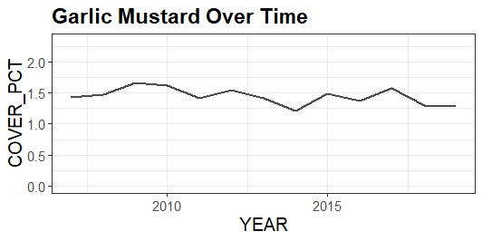
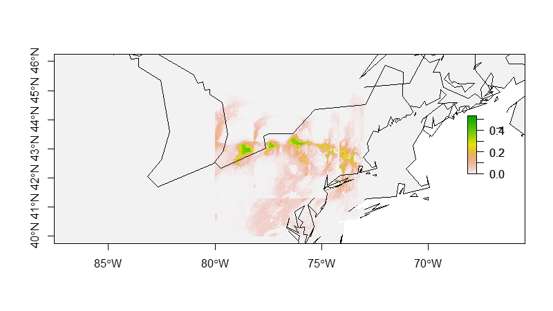
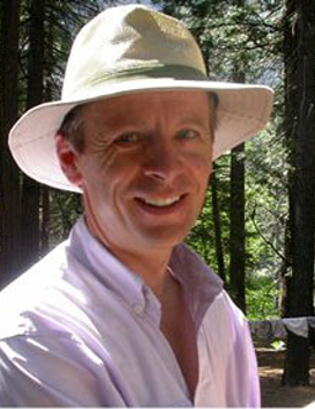
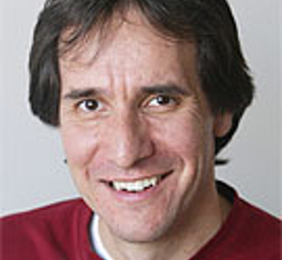

## rFIA Package 
{width=50%}

## How We Can Use FIA Data
* Land Value Assessment
* Conservation Biology
* Species Distribution Models
* Invasive Ecology
* Urban Planning
* Fire Management

## 

## rFIA Functions

Mostly Involved with species land cover, tree ring data, growth rates, and abundances. 

Some of the main functions:

* `Carbon()- Estimate carbon stocks of forest`
* `Diversity()- Estimate species diversity of plot`
* `Invasive()- Estimate coverage of invasive species`
* `Tpa()- Estimates abundance of standing trees`

## Example Run

```r
#Load the Library
library(rFIA)
library(tidyverse)
#Get Data
NY<- getFIA("NY")
#Invasive Species Coverage
Invasive_NY <- invasive(NY)
#Filter It
Garlic_Mustard <- filter(Invasive_NY, COMMON_NAME == "garlic mustard")
```
## Example Run Continued


* Garlic Mustard Percentage Graphed Over Time
* `NYS Records Between 2007-2019`

## Dismo
### rFIA Data can be combined with other occurence data to generate predictive maps

* Lets look at some of the Dismo functions...
* `Bioclim()- Algorithm to find similar environments`
* `Evaluate()- Evaluates accuracy of the model`
* `Predict()- Generates raster showing expected locations`
* `NicheOverlap()- Finds habitats where species overlap

## Example


## Meet The Authors
### Robert J. Hijmans, Steven Phillips, John Leathwick and Jane Elith
* Hijmans- Researcher for Department of Environmental Science and Policy at University of California
* Phillips- Researcher that has worked for multiple companies and universities and is currently employed by the American Museum of Natural History
* Leathwick- Researcher for Department of Conservation at the University of Canterbury but has become a self-employed conservation consultant since 2014
* Elith- Professor and Model Developer of Botany and plant distributions at University of Melbourne. 

## Hijmans


## Phillips


## Leathwick


## Elith


