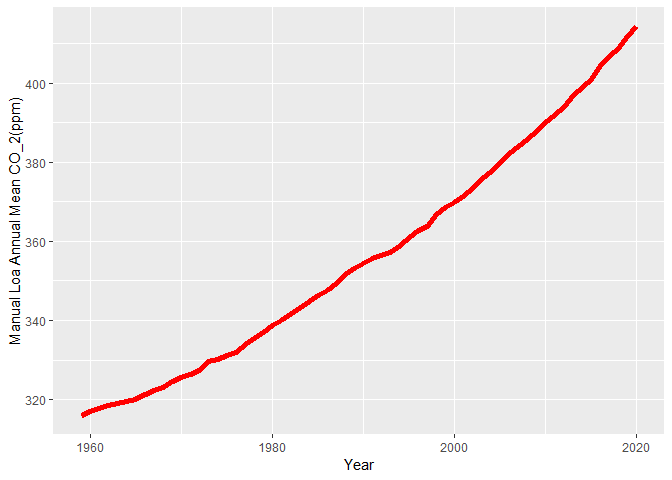

Case Study 08
================
Sean Colby
August 1, 2020

``` r
#Load Packages
library(tidyverse)
library(dplyr)
library(kableExtra)

#Read data in
URL<- ("https://gml.noaa.gov/webdata/ccgg/trends/co2/co2_annmean_mlo.txt")
Data <- read_table(URL, skip=57, col_names= c("year", "mean", "unc"))
```

    ## 
    ## -- Column specification ------------------------------------------------------------
    ## cols(
    ##   year = col_double(),
    ##   mean = col_double(),
    ##   unc = col_double()
    ## )

``` r
#Plot it
ggplot(data=Data,mapping=aes(x=year, y=mean))+
geom_line(color="red", size=2)+
xlab("Year")+
ylab("Manual Loa Annual Mean CO_2(ppm)")
```

<!-- -->

``` r
#Top 5 Mean Table
Top5 <- Data%>%
arrange(desc(mean))%>%
top_n(mean, n=5)

#Print Top5
Top5
```

    ## # A tibble: 5 x 3
    ##    year  mean   unc
    ##   <dbl> <dbl> <dbl>
    ## 1  2020  414.  0.12
    ## 2  2019  412.  0.12
    ## 3  2018  409.  0.12
    ## 4  2017  407.  0.12
    ## 5  2016  404.  0.12

``` r
#Knit
knitr::kable(Top5)
```

<table>
<thead>
<tr>
<th style="text-align:right;">
year
</th>
<th style="text-align:right;">
mean
</th>
<th style="text-align:right;">
unc
</th>
</tr>
</thead>
<tbody>
<tr>
<td style="text-align:right;">
2020
</td>
<td style="text-align:right;">
414.24
</td>
<td style="text-align:right;">
0.12
</td>
</tr>
<tr>
<td style="text-align:right;">
2019
</td>
<td style="text-align:right;">
411.66
</td>
<td style="text-align:right;">
0.12
</td>
</tr>
<tr>
<td style="text-align:right;">
2018
</td>
<td style="text-align:right;">
408.72
</td>
<td style="text-align:right;">
0.12
</td>
</tr>
<tr>
<td style="text-align:right;">
2017
</td>
<td style="text-align:right;">
406.76
</td>
<td style="text-align:right;">
0.12
</td>
</tr>
<tr>
<td style="text-align:right;">
2016
</td>
<td style="text-align:right;">
404.41
</td>
<td style="text-align:right;">
0.12
</td>
</tr>
</tbody>
</table>
